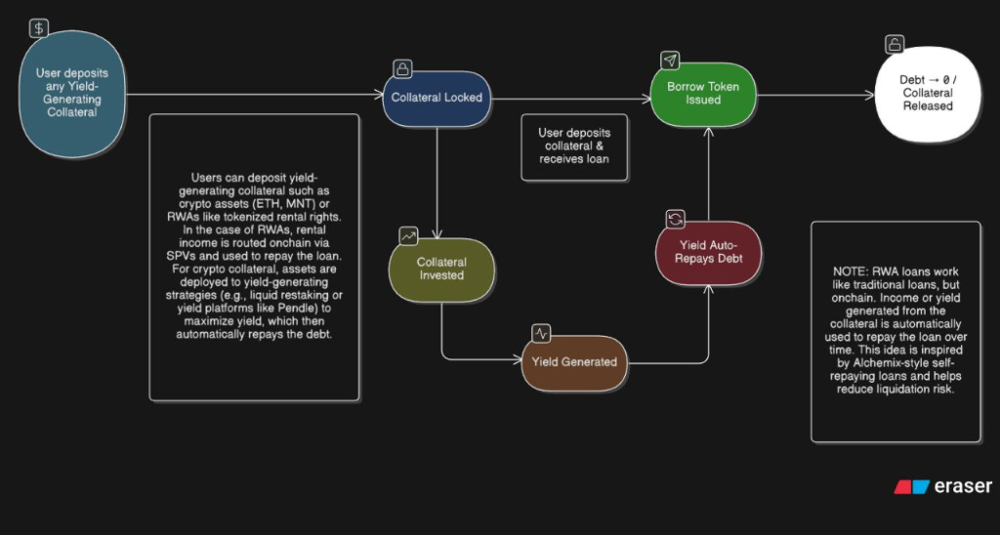

# Orbit Finance

**A Hybrid Self-Repaying Lending Protocol Combining DeFi + Real-World Assets**

Orbit Finance is a next-generation lending protocol that enables automatic debt repayment through yield generation. By combining traditional DeFi collateral with tokenized Real-World Assets (RWAs), Orbit creates a sustainable borrowing experience where your debt reduces over time without manual intervention.

---

## 🏗 Architecture Overview



### Protocol Flow

The diagram above illustrates the complete self-repaying loan lifecycle:

1. **User Deposits Collateral** - Yield-generating assets (crypto or RWAs)
2. **Collateral Locked** - Secured in smart contracts
3. **Borrow Token Issued** - User receives orUSD stablecoin
4. **Collateral Invested** - Deployed to yield strategies or SPVs
5. **Yield Generated** - Continuous income from DeFi protocols or real-world cash flows
6. **Yield Auto-Repays Debt** - Automatic debt reduction without manual intervention
7. **Debt Paid → Collateral Released** - Full repayment unlocks collateral

> **Note:** RWA loans work like traditional loans but with on-chain transparency. Yield generated from the collateral is automatically used to repay the loan over time, inspired by Alchemix-style self-repaying mechanics.

---

## 🔄 How Orbit Finance Works (Step-by-Step)

### The Self-Repaying Loan Process

1. **Deposit Collateral**
   - Users can deposit **DeFi tokens** (WETH, USDC) or **tokenized RWAs** (rental income NFTs, invoice-backed assets, bonds)
   - Collateral is locked in secure smart contracts

2. **Borrow Stablecoins**
   - Borrow against your collateral at competitive LTV ratios
   - Receive orUSD (Orbit's synthetic stablecoin) or USDC

3. **Yield Generation Begins**
   - **DeFi Collateral**: Automatically deployed to yield-generating vaults and strategies
   - **RWA Collateral**: Generates real-world cash flows (rental income, invoice payments, bond coupons)

4. **Automatic Debt Repayment**
   - All generated yield is routed to the Auto-Repayment Engine
   - Yield is automatically applied to reduce your outstanding debt
   - No manual repayment transactions required

5. **Debt Reduces Over Time**
   - Your loan balance decreases continuously as yield accrues
   - Liquidation risk is significantly reduced
   - Eventually, your loan can be fully repaid by the yield alone

### Simplified Flow

```
Deposit Collateral (DeFi or RWA) → Take a Loan → 
Behind the scenes, collateral generates yield → 
Yield automatically reduces your debt
```

### Inspiration & Innovation

Orbit Finance is **inspired by Alchemix** but extends the self-repaying loan concept to:
- **Real-World Assets (RWAs)** with institutional-grade compliance
- **Hybrid liquidity pools** combining on-chain and off-chain yield
- **KYC/AML-compliant flows** for regulated asset classes

---

## 🪙 Tokenomics

Orbit Finance features a three-token system designed for governance, risk-adjusted yield, and protocol sustainability.

### Token Overview

| Token | Name | Purpose | Key Features |
|-------|------|---------|-------------|
| **ORB** | Orbit Governance Token | Protocol governance and utility | • Voting on protocol parameters<br>• Staking for fee discounts<br>• Treasury management<br>• Protocol revenue sharing |
| **srORB** | Senior Tranche Token | Low-risk RWA investment | • Priority claim on RWA cash flows<br>• Lower yield, lower risk<br>• Institutional-grade stability<br>• First-loss protection |
| **jrORB** | Junior Tranche Token | High-risk/high-yield RWA investment | • Subordinated claim on cash flows<br>• Higher yield potential<br>• Absorbs first losses<br>• Enhanced returns for risk tolerance |

### ORB Token Utility

**Governance**
- Vote on protocol upgrades and parameter changes
- Propose new RWA asset classes
- Manage protocol treasury allocation

**Staking Benefits**
- Reduced borrowing fees (up to 50% discount)
- Boosted yield farming rewards
- Access to exclusive RWA pools
- Revenue sharing from protocol fees

**Protocol Incentives**
- Liquidity mining rewards for DeFi vaults
- RWA originator incentives
- Referral bonuses
- Early adopter rewards

### Tranche Tokens (srORB & jrORB)

**Senior Tranche (srORB)**
- **Target APY**: 6-8% (stable, predictable)
- **Risk Profile**: Low - first claim on all RWA cash flows
- **Ideal For**: Conservative investors, institutions, treasuries
- **Protection**: Junior tranche absorbs first 20% of losses

**Junior Tranche (jrORB)**
- **Target APY**: 12-18% (variable, performance-based)
- **Risk Profile**: Higher - subordinated to senior tranche
- **Ideal For**: Risk-tolerant investors seeking enhanced yields
- **Upside**: Captures excess returns after senior obligations met

### Token Distribution (Planned)

> **Note:** Final token distribution and supply details will be announced in the upcoming token generation event (TGE).

**Preliminary Allocation Framework:**
- Community & Ecosystem: 40%
- Team & Advisors: 20% (4-year vesting)
- Treasury & Protocol Development: 20%
- Liquidity Mining & Incentives: 15%
- Early Backers: 5%

---

## 📜 Smart Contracts (Mantle Sepolia Testnet)

All contracts are deployed on **Mantle Sepolia Testnet** (Chain ID: 5003).

### Core Protocol Contracts

| Contract | Address | Description |
|----------|---------|-------------|
| **AccountFactory** | `0xda796117bf6905dd8db2ff1ab4397f6d2c4adda3` | Creates user lending accounts |
| **DebtManager** | `0xa7240bcff60eef40f31b8ed5d921bad6db13b199` | Manages debt positions and orUSD minting |
| **VaultRegistry** | `0xea2e668d430e5aa15baba2f5c5edfd4f9ef6eb73` | Registry of all yield-generating vaults |
| **PriceOracle** | `0xae7b7a1c6c4d859e19301ccac2c6ed28a4c51288` | Provides real-time asset price feeds |
| **orUSD** | `0xc565eb7363769f8ffae0005285ccd854c631a0a0` | Orbit's synthetic stablecoin |

### DeFi Collateral Vaults

| Contract | Address | Description |
|----------|---------|-------------|
| **WETH Vault** | `0x294c69bd8415219b41b68a2f065deabb950dd489` | WETH yield-generating vault |
| **USDC Vault** | `0x48288d0e3079a03f6ec1846554cfc58c2696aaee` | USDC yield-generating vault |
| **WETH Strategy** | `0x222d74f33b0d07687a769a44399e2272a4cb9ffe` | WETH yield strategy implementation |
| **USDC Strategy** | `0x88777418972fb3f58489303d763d4daf398a6527` | USDC yield strategy implementation |

### RWA Protocol Contracts

| Contract | Address | Description |
|----------|---------|-------------|
| **IdentityRegistry** | `0x5edb3ff1ea450d1ff6d614f24f5c760761f7f688` | KYC/AML identity verification registry |
| **RWAIncomeNFT** | `0x81a5186946ce055a5ceec93cd97c7e7ede7da922` | Tokenized real-world income-generating assets |
| **OrbitRWAPool** | `0x98f74b7c96497070ba5052e02832ef9892962e62` | Main RWA lending pool |
| **SPVManager** | `0x831c6c334f8ddee62246a5c81b82c8e18008b38f` | Special Purpose Vehicle manager for RWA cash flows |
| **SeniorTranche** | `0xf47e3b0a1952a81f1afc41172762cb7ce8700133` | Senior tranche for institutional investors |
| **JuniorTranche** | `0xc63db9682ff11707cadbd72bf1a0354a7fef143b` | Junior tranche for higher-risk/higher-yield |
| **WaterfallDistributor** | `0xfc3983de3f7cbe1ba01084469779470ad0bbeffa` | Distributes RWA cash flows across tranches |
| **BundlePool** | `0xf4c5c29b14f0237131f7510a51684c8191f98e06` | Bundled RWA asset pool for diversification |

### Collateral Assets

| Asset | Address | Description |
|-------|---------|-------------|
| **WETH** | `0x039d7496e432c6aea4c24648a59318b3cbe09942` | Wrapped Ether collateral token |
| **USDC** | `0xbf97defeb6a387215e3e67dfb988c675c9bb1a29` | USD Coin collateral token |

---

## 🚀 Vision

### Our Mission

Orbit Finance aims to become the **leading self-repaying lending protocol** by creating a unified liquidity layer that bridges DeFi and Real-World Assets. We believe that sustainable, yield-backed borrowing is the future of decentralized finance.

### Short-Term Milestones (Q1 2026)

- ✅ Launch on Mantle Sepolia Testnet
- 🎯 Achieve **$1M+ TVL** in combined DeFi + RWA collateral
- 🎯 Onboard **10+ institutional RWA originators**
- 🎯 Complete security audits for mainnet deployment
- 🎯 Launch governance token and initial liquidity mining programs

### Long-Term Vision

**Institutional RWA Integration**
- Partner with regulated asset originators (real estate, invoice financing, bonds)
- Build compliant on-chain/off-chain bridge for institutional capital
- Enable fractional ownership of high-value RWAs

**Sustainable Yield Ecosystem**
- Diversified yield sources across DeFi protocols and real-world cash flows
- Risk-adjusted tranching for different investor profiles
- Automated portfolio rebalancing for optimal yield generation

**Cross-Chain Expansion**
- Deploy on Ethereum, Arbitrum, Optimism, and other L2s
- Enable cross-chain collateral and yield aggregation
- Build interoperable RWA standards

**Compliance & Regulatory Leadership**
- KYC/AML-compliant flows for institutional participants
- Regulatory-friendly RWA tokenization framework
- Transparent reporting and audit trails

---

## 🛠 Technology Stack

- **Smart Contracts**: Solidity ^0.8.24
- **Frontend**: React + TypeScript + Vite
- **Web3 Integration**: Wagmi + Viem
- **Blockchain**: Mantle Sepolia Testnet
- **Styling**: TailwindCSS

---

## 📊 Key Features

### DeFi Mode
- Deposit WETH/USDC as collateral
- Borrow orUSD against your deposits
- Automatic yield generation through vault strategies
- Self-repaying loans with zero manual intervention

### RWA Mode
- Tokenize real-world income-generating assets
- KYC/AML-verified institutional access
- Senior/Junior tranche investments
- SPV-managed cash flow distribution
- Bundle pools for diversified RWA exposure

### Hybrid Liquidity
- Combine DeFi and RWA collateral in a single account
- Cross-collateralization for improved capital efficiency
- Unified debt management across asset classes

---

## 🔐 Security

- All smart contracts follow industry best practices
- Comprehensive test coverage
- Audits planned before mainnet deployment
- Multi-sig governance for protocol upgrades

---

## 📄 License

MIT License - See [LICENSE](./LICENSE) for details

---

## 🤝 Contributing

Contributions are welcome! Please read our contributing guidelines before submitting PRs.

---

## 📞 Contact & Community

- **Website**: [Coming Soon]
- **Twitter**: [Coming Soon]
- **Discord**: [Coming Soon]
- **Documentation**: [Coming Soon]

---

**Built with ❤️ by the Orbit Finance Team**

*Revolutionizing lending through automatic debt repayment*
